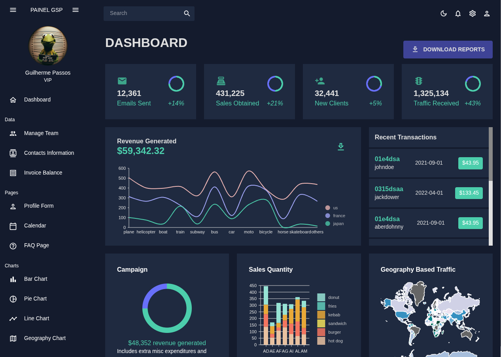
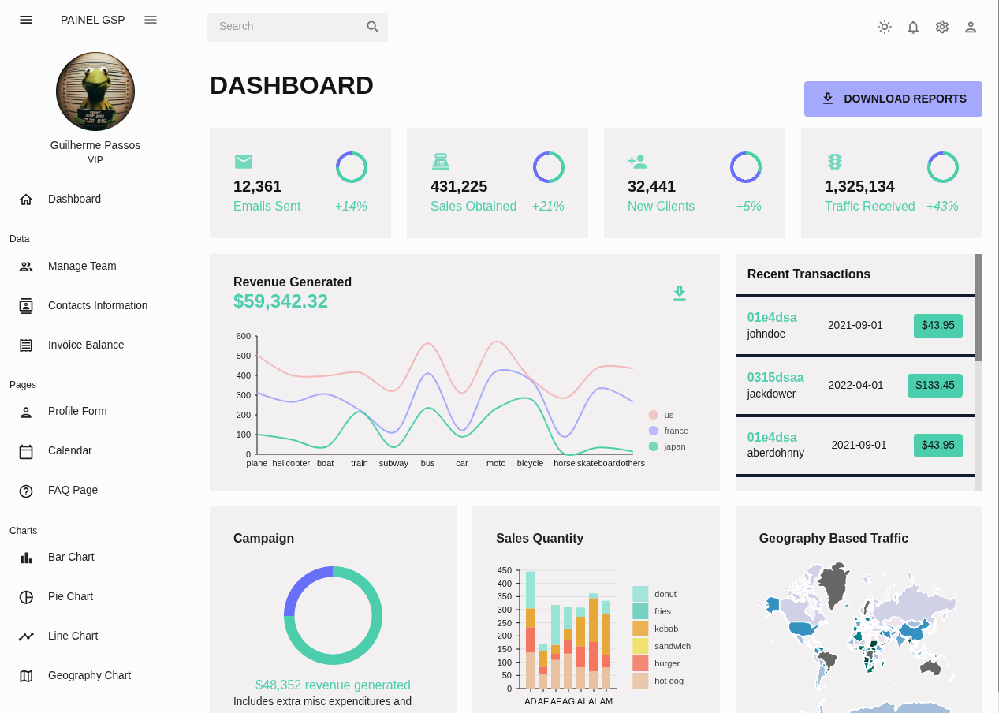

# 📊 Admin Dashboard

A modern, admin dashboard built with React and Material UI. This project showcases professional UI components, data visualization, and dynamic features suitable for admin panels, management systems, and analytical tools.

## 🚀 Features

- 📈 Interactive charts with **Nivo**
- 📅 Calendar integration using **FullCalendar**
- 🗂️ Advanced tables with **Data Grid**
- ✅ Form validation with **Formik + Yup**
- 🌗 Light and dark theme support
- 🔥 Fully responsive design
- 🧩 Clean and modular component architecture

## 🛠️ Tech Stack

- **React**
- **Material UI (MUI)**
- **Nivo (Charts)**
- **Formik & Yup (Forms and Validation)**
- **FullCalendar (Calendar)**
- **MUI Data Grid (Tables)**
- **React Router**

## 📸 Screenshots

### 🌙 Dashboard - Dark Mode


### 🏠 Dashboard - Light Mode



## 🧑‍💻 Author

**Guilherme Soares Passos**
- **<a href="https://www.linkedin.com/in/guilherme-passos369/">LinkedIn</a>**
- **<a href="https://github.com/guilherme-369">GitHub</a>**

## 📜 License
- This project is licensed under the MIT License - feel free to use and modify it as needed.

## 💻 Installation

```bash

# Clone the repository
git clone https://github.com/guilherme-369/dashboard-project.git

# Install dependencies
npm install

# Run the app
npm run dev
